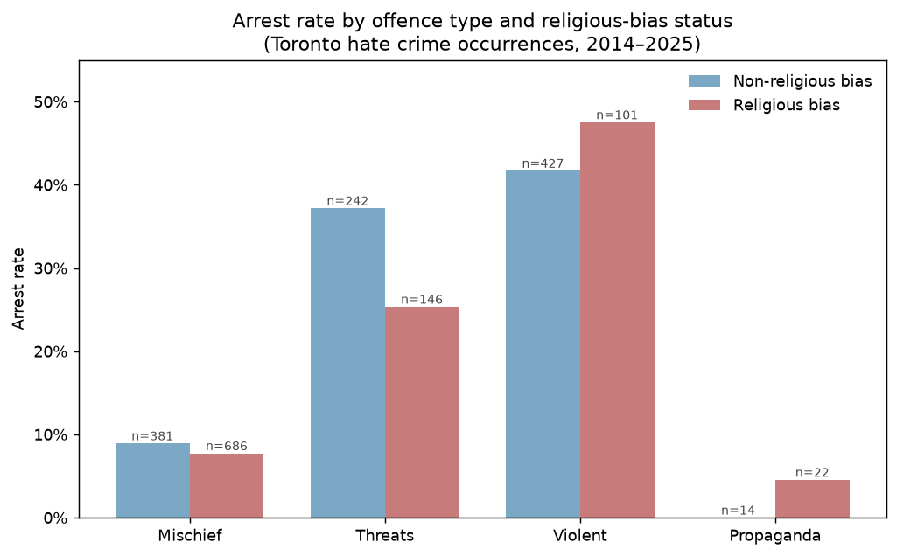

# Disentangling Offence Composition from Differential Response in Toronto Hate-Crime Arrests

An inferential analysis of whether the lower arrest rate for religious-bias hate
crimes in Toronto reflects how police respond, or simply what kinds of crime are
being committed.

## Question
Religious-bias hate crimes in Toronto are arrested at roughly half the rate of
other hate crimes (~15% vs ~28%). Does this reflect a difference in police
response to religious-bias crimes — or is it explained by offence composition,
with religious-bias incidents concentrated in the kinds of crime (property
mischief) that are hard to clear for anyone?

## Finding
The gap is explained by composition, not differential response. In a logistic
regression, the raw association between religious bias and lower arrest
(odds ratio 0.43, p < 0.001) does not survive controlling for offence type
(OR 0.86, 95% CI [0.67–1.12], p = 0.26 — the interval crosses 1.0,
indicating no detectable effect). Religious-bias hate crimes concentrate in
low-clearing property mischief; once offence type is accounted for, there is no
measurable difference in arrest rate by religious-bias status. Offence type,
not bias status, drives the arrest difference.

Within each offence category, the arrest-rate gap largely disappears (mischief)
or reverses (violent), confirming the composition explanation. Threats is a
partial exception, and propaganda has too few cases to interpret (shown with
sample sizes for transparency).

## Scope and limitations
This analysis describes how police responded to incidents the Toronto Police
Hate Crime Unit confirmed and classified as hate crimes — not hate crime
incidence, and not "bias." The data includes only verified hate crimes
(unfounded cases and non-criminal hate incidents are excluded), so the
classification itself reflects investigative judgment. Arrest is one enforcement
action, not a measure of justice. Offence type is one confounder; year, location,
and investigative effort are uncontrolled. Several offence categories have small
samples. The defensible conclusion is deliberately narrow: the raw arrest gap is
attributable to crime composition, not to a measurable difference in arrest
response by religious-bias status.

## Data
Toronto Police Service, Hate Crime Open Data — confirmed hate-crime occurrences
investigated by the Hate Crime Unit, with occurrence dates from August 2014 to
December 2025. Released under the Open Government Licence – Ontario. Analysis
covers 2,019 incidents after excluding 22 uncategorizable "Other" offences.

Source: [Toronto Police Service Hate Crime Open Data](https://data.tps.ca/datasets/TorontoPS::hate-crimes-open-data/about)
(Open Government Licence – Ontario). The exact snapshot analyzed is included in
`data/raw/` for reproducibility.

## Method
Logistic regression used for inference, not prediction: arrest modelled on
religious-bias status, with and without controlling for offence type, reading
coefficients and confidence intervals rather than predictive accuracy. The 30
raw offence types were grouped into four behavioral categories (mischief,
violent, threats, propaganda) by whether the offence tends to have an
identifiable suspect — the factor driving arrest likelihood. Grouping decisions,
including edge cases, are documented in the notebook.

## Repository
- `notebooks/hate_crime_arrests.ipynb` — full analysis
- `data/raw/hate_crime_raw.csv` — source data
- `figures/arrest_by_offence.png` — main result figure

## Tools
Python · pandas · statsmodels · matplotlib
